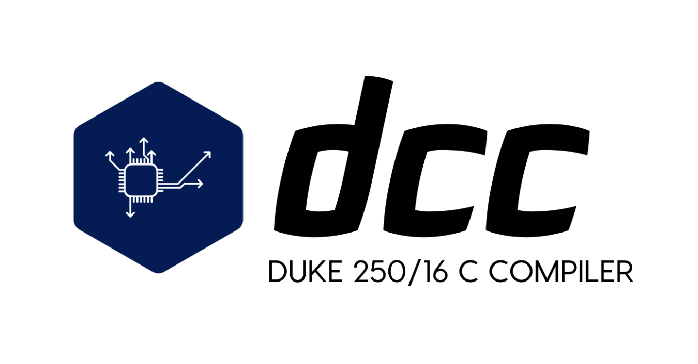

This is a C compiler targeting the Duke 250/16 architecture.

This project is still very much a work in progress. The end goal is to be able to compile a large enough subset of the C
language to be sufficient for general-purpose demonstrations and implementation of simple algorithms. If I can eventually get 
`HoopsStats.c` compiled and running on this, I'll be a happy man.

**Completion Status**: `Not Even Close`

## Instructions

### Usage

To compile a source file `program.c`, run:

```bash
dcc program.c
```

If using the development version, instead use:

```bash
dotnet run program.c
```

This will produce the output file `program.s`, containing assembly code in the
Duke 250/16 architecture.

#### Duke 250/16 assembler and simulator

There is an assembler and simulator for the Duke 250/16 packaged with this
repository, included in the `asm-sim` folder. These are not written by me. For more information about these programs, please contact Professor Daniel Sorin, Duke University.

To assemble and run the compiled program, first build the assembler and simulator from source:

```bash
cd asm-sim
make
```

Then, run the assembler:

```bash
./asm program.s
```

This will produce two output files:

- `program.imem.lgsim` - Instruction memory image
- `program.dmem.lgsm` - Data memory image

These are [Logisim](http://www.cburch.com/logisim/)-compatible memory image files,
which can either be loaded into the RAM and ROM components of a Logisim implementation
of the Duke 250/16, or run with the included simulator.

To run these programs with the included simulator, use:

```bash
./sim program.imem.lgsim program.dmem.lgsim
```

For more details about the Duke 250/16 assembler and simulator, please see the included
`README.md` in the `asm-sim` folder.

## Contributing

Feel free to contribute via pull requests or suggestions. More example programs are also
welcome.

### Build Instructions

This compiler is written in C# .NET. To build, you'll need to install the .NET developer
tools. To check if you have this installed, you can run:

```bash
dotnet --version
```

To build, run:

```bash
dotnet build
```

## The Duke 250/16 Architecture

The Duke 250/16 is a 16-bit MIPS-like, word-addressed RISC architecture created for educational purposes in the `COMPSCI 250` course at Duke University.

### Instruction Set

| Instruction  	| Opcode 	| Type 	| Usage                  	| Operation
|---------  	|--------	|------	|------------------------	|------------
| `lw`         	| `000`    	| `I`  	| `lw $rt, Imm($rs)`       	| `$rt = Mem[$rs+Imm]`
| `sw`         	| `001`    	| `I`  	| `sw $rt, Imm($rs)`       	| `Mem[$rs+Imm] = $rt`
| `beq`        	| `010`   	| `I`  	| `beq $rs, $rt, Imm`      	| `if ($rs==$rt) then PC=PC+1+Imm`
| `blt`        	| `011`   	| `I`  	| `blt $rs, $rt, Imm`      	| `if ($rs<$rt) then PC=PC+1+Imm`
| `not`        	| `100`    	| `R`  	| `not $rd, $rs`           	| `$rd = NOT $rs`
| `xor`        	| `101`    	| `R`  	| `xor $rd, $rs, $rt`      	| `$rd = $rs XOR $rt`
| `addi`       	| `110`    	| `I`  	| `addi $rt, $rs, Imm`     	| `$rt=$rs+Imm`
| `add`        	| `111`    	| `R`  	| `add $rd, $rs, $rt`      	| `$rd=$rs+$rt`
| `sub`        	| `1000`   	| `R`  	| `sub $rd, $rs, $rt`      	| `$rd=$rs-$rt`
| `shra`       	| `1001`   	| `R`  	| `shra $rd, $rs, <shamt>` 	| `$rd` = `$rs` shifted `<shamt>` to right
| `shl`        	| `1010`   	| `R`  	| `slh $rd, $rs, <shamt>`  	| `$rd` = `$rs` shifted `<shamt>` to left
| `j`          	| `1011`   	| `J`  	| `j L`                    	| `PC = L` (upper 4 bits same)
| `jal`        	| `1100`   	| `J`  	| `jal L`                  	| `$r7=PC+1; PC = L`
| `jr`         	| `1101`   	| `R`  	| `jr $rs`                 	| `PC = $rs`
| `output`     	| `1110`   	| `R`  	| `output $rs`             	| print `$rs` on a TTY display
| `input`      	| `1111`   	| `R`  	| `input $rd`              	| `$rd` = keyboard input

### Memory Layout

- Instruction Memory
    - Text: `0x0000` – `0xFFFF`

- Data Memory
    - Stack: Stack pointer is initially `0x7FFF`. Grows down
    - Heap: `0x2000` and grows up
    - Static Data: `0x0000` – `0x1FFF`

### Registers

There are 8 registers in the register file of the Duke 250/16, in addition to the `PC`
program counter register (which is not in the register file). These registers are named
`r0` through `r7`. Registers can each hold one word, which is two bytes.

Here are their conventional uses and descriptions:

- `r0` is always equal to `0`
- `r1` – `r4` are general-purpose callee-saved registers
    - May be used to pass parameters
- `r5` is the return value
- `r6` is the stack pointer
- `r7` is the link register for `jal`, similar to `$ra` in MIPS

### Functions and Variables

All local variables will live on the stack. The compiler will keep track of the stack
for the local scope. Whenever an operation needs to manipulate local variables, they will
all be copied from the stack into registers `r1` – `r5` (as needed), the operation will be
performed on them, and then they will be copied back into their corresponding positions on
the stack.

## Roadmap

### Compilation Process

- [x] Basic source code parsing
- [x] Preprocessing
- [x] Tokenization
- [ ] Parsing into AST
- [ ] Optimization (long-term, low-priority)
- Code generation
    - [ ] Targeting Duke 250/16
    - [ ] Targeting regular MIPS (long-term, low-priority)
    - [ ] Targeting x86 (long-term, low-priority)

### Language Features

- [x] Comments and white space
- [x] Preprocessor `#include`
- [ ] Preprocessor `#define`
- [x] Global (static memory) variables
- [ ] Functions
- [ ] Locally-scoped (stack) variables
- [ ] Basic arithmetic operations
- [ ] Pointers and pointer arithmetic
- [ ] Array syntax
- [x] Input and output library (`putc`, `getc`)
- [ ] Control flow statements and blocks
    - [ ] Labels and `goto`
    - [ ] `if` and `else`
    - [ ] `for` and `while` loops
    - [ ] `switches` (long-term, low-priority)
- [ ] `enum`s (low-priority)
- [ ] `struct`s
    - [ ] `typedef`
- [ ] Dynamic memory allocation library (`malloc`, `free`)

### Compiler Features

- [ ] Proper error reporting (line number, etc)
